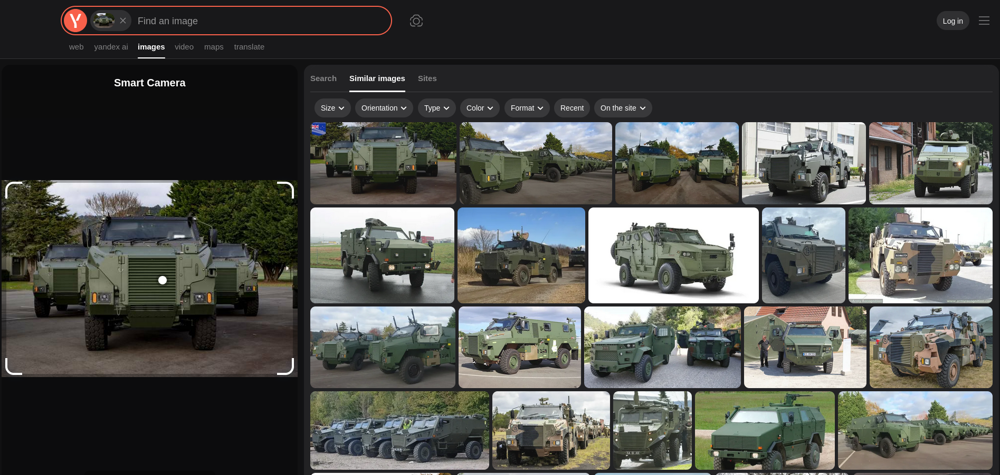

# The Puppet Master

## Vehicle Identification

> What type of military vehicle is shown in the image? Look at the vehicle's characteristics: it's wheeled, armored, and appears to be a personnel carrier. Research similar vehicles online.

A reverse image search gives us the source, including the video [New Zealand Army receives first Bushmaster vehicles](https://www.youtube.com/watch?v=CaZHxVlRHPA).

**Answer: Bushmaster**

## Manufacturer Identification

> Who is the manufacturer/designer of this vehicle? Research the company that designed and produces this specific armored vehicle.

Knowing the name, we can look up [the vehicle's Wikipedia page](https://en.wikipedia.org/wiki/Bushmaster_Protected_Mobility_Vehicle).

The answer lies in the `Production history` section.

**Answer: Thales Australia**

## Service History

> When did this vehicle first enter military service? Research the year this specific vehicle type was first deployed operationally.

On Wikipedia:

> In service	1997–present

**Answer: 1997**

## Country of Origin

> What is the country of origin for this vehicle? Research where this specific vehicle was originally designed and manufactured.

On Wikipedia:

> Place of origin	Australia

**Answer: Australia**

## Vehicle Capacity

On Wikipedia:

> Specifications
> Crew	1 (driver),
> 		9 (passengers)

**Answer: 9 passengers and 1 driver**
