# Advent of The Relics 2 - Operation Winter Blackout

## 1 How many suspects are using this forum?

"Suspects" are basically all members on the forum.

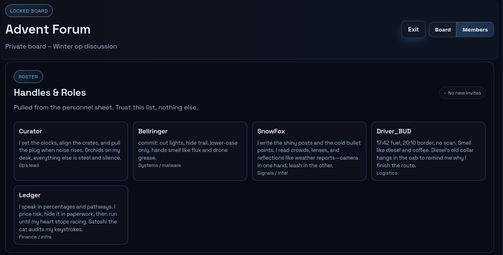

> **ANSWER:** 5

## 2 What is the username of the group's leader?

The one with the "Ops lead" role.

> **ANSWER:** Curator

## 3 What is Driver\_BUD's real first name?

In the "Off topic" category, the thread "RIP Diesel" contains some personal information, including the name we're looking for in a reply to Driver\_BUD's message.

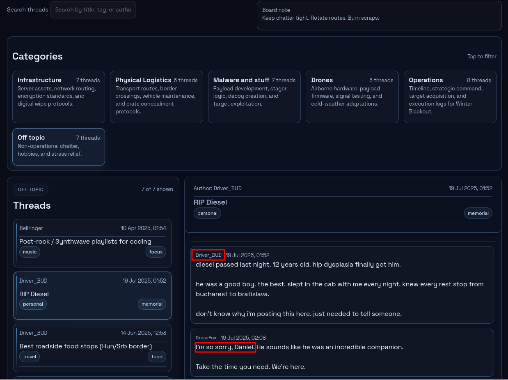

> **ANSWER:** Daniel

Note: real names including this one can also be found in other threads - not the best OPSEC.

## 4 What is the codename of the operation?

The 1st threat in the "Operations" category declares the operation's name.

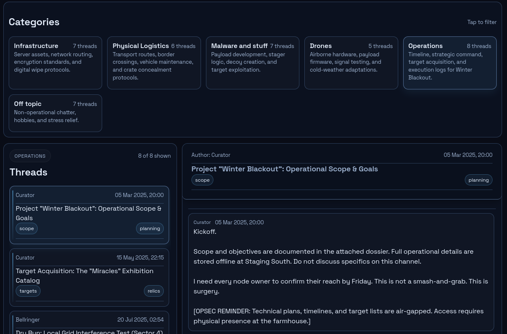

> **ANSWER:** Winter Blackout

## 5 What single word is the trigger code that activates all nodes?

The thread `Sync Logic: "Midnight" Trigger Protocol Finalized` in the "Operations" category tells us the trigger word.

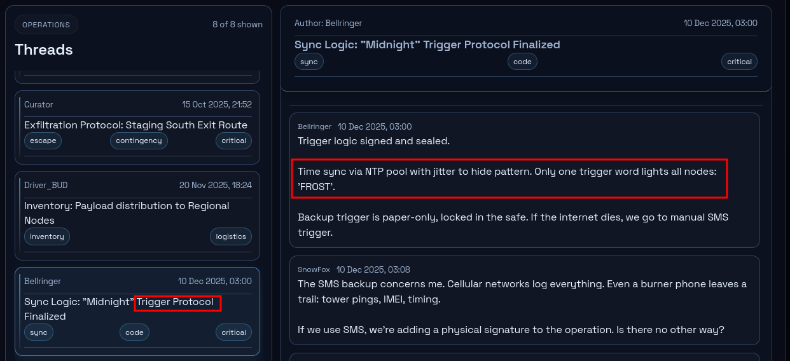

> **ANSWER:** FROST

## 6 What is the name of the fake exhibition used as cover for the heist?

The thread `Forged Manifests: "Miracles of Winter" Exhibition` in the "Physical Logistics" category tells us the exhibition name.

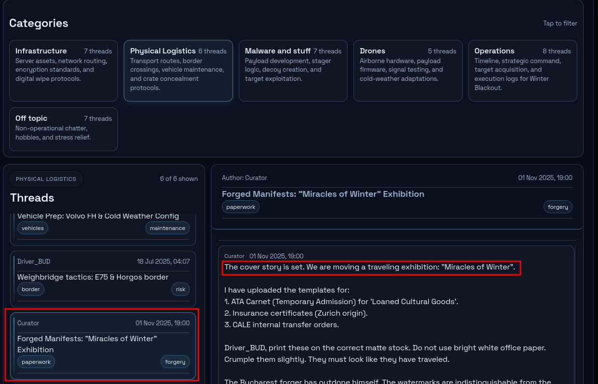

> **ANSWER:** Miracles of Winter

## 7 What time was the single word trigger scheduled to execute on New Year's Eve?

Back in the thread `Sync Logic: "Midnight" Trigger Protocol Finalized`, we find the trigger time.

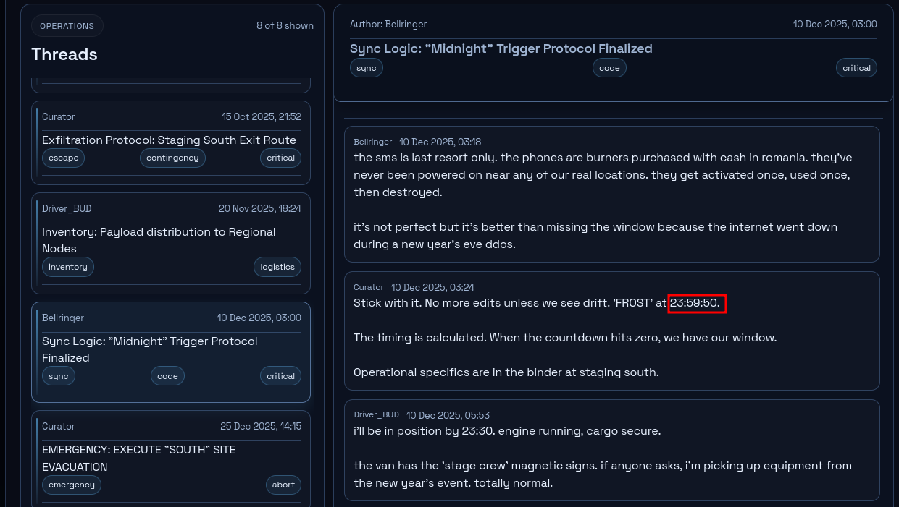

> **ANSWER:** `23:59:50`

## 8 What is the full name of the phishing target at CALE?

In `Operation Winter Blackout: Patient Zero (Belgrade)`, the phishing target is the Patient Zero.

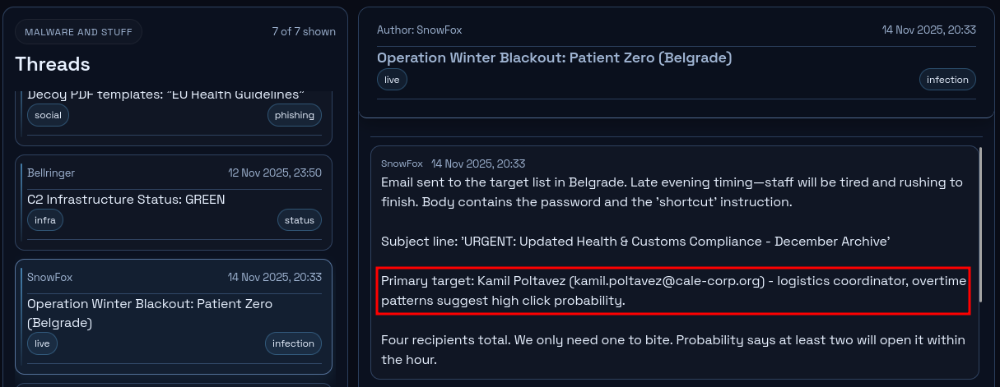

> **ANSWER:** Kamil Poltavez

## 9 What make and model is the truck used for transport?

Vehicle information can be found in category "Physical Logistics" thread `Vehicle Prep: Volvo FH & Cold Weather Config`.

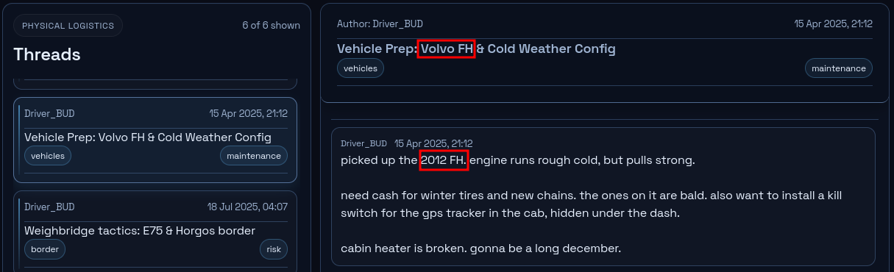

> **ANSWER:** Volvo FH

## 10 What is the name of Ledgers cat?

Pets are off-topic, so of course we can find it in the "Off topic" category.
While "cat" is not explicitly mentioned, the thread `Post-rock / Synthwave playlists for coding` has a message from Ledger describing their pet.

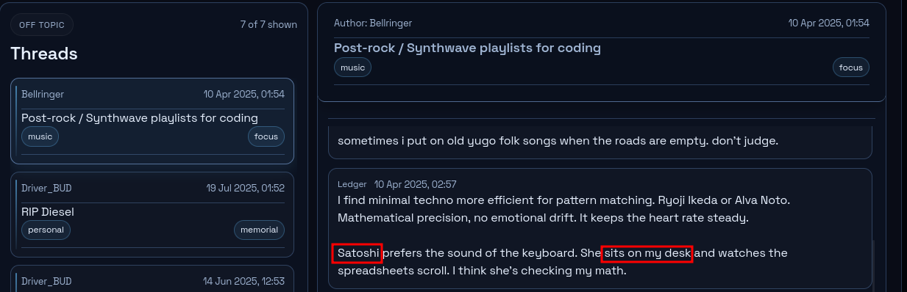

> **ANSWER:** Satoshi

Note: as a surprise to no one, the cat known something off of Ledger's desk in another thread.

## 11 What is the primary C2 domain used for beacon check-ins?

This was already found in [Part 1](../aotr1/README.md), but it's also discussed here in the thread `C2 Infrastructure Status: GREEN`.

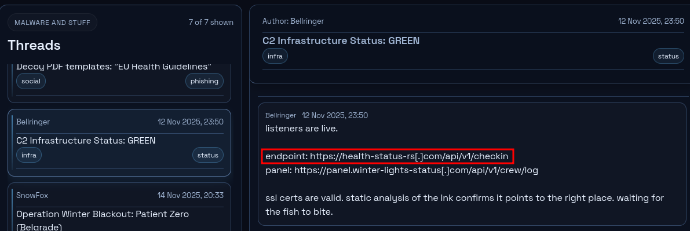

> **ANSWER:** health-status-rs.com

## 12 In which city is the VPS server hosting the C2 panel?

Further down the thread `C2 Infrastructure Status: GREEN`, the VPS server location can be found.

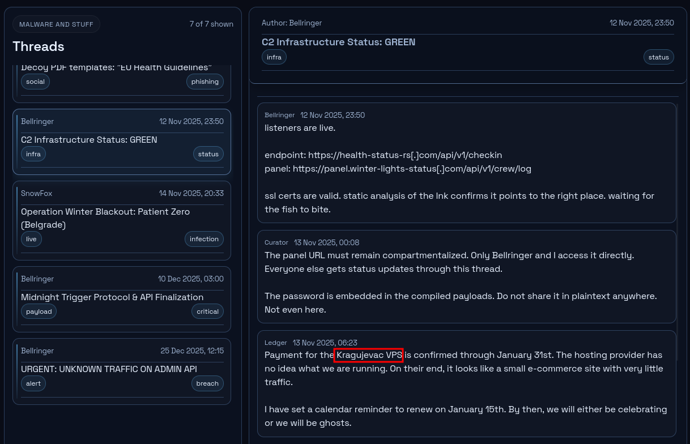

> **ANSWER:** Kragujevac

## 13 On what date did the C2 listeners go live?

In the same chat above, we can find the date of the "listeners are live" message.

> **ANSWER:** 2025-11-12

## 14 In which city is the document forger located?

The forgery is discussed in `Forged Manifests: "Miracles of Winter" Exhibition`.

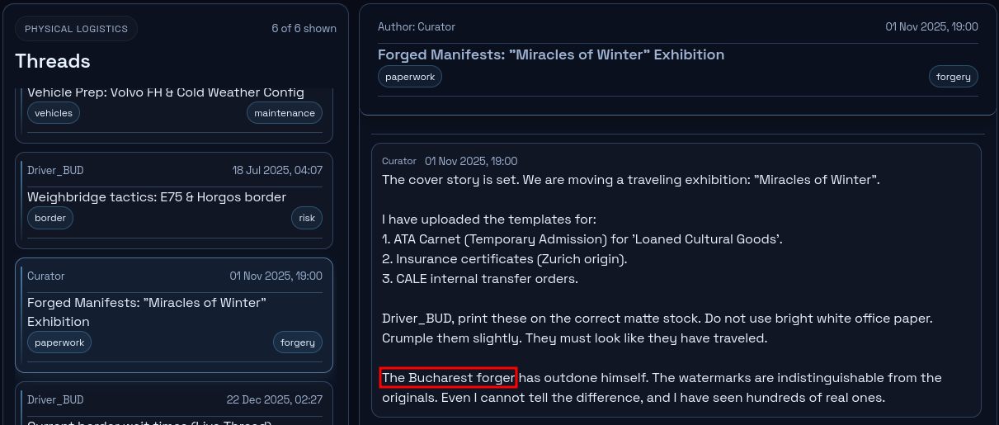

> **ANSWER:** Bucharest

## 15 What shell company was used as a backup cover story?

The backup is discussed in the operational contingency thread `Contingency Protocols: If "Carnet" access is revoked`.

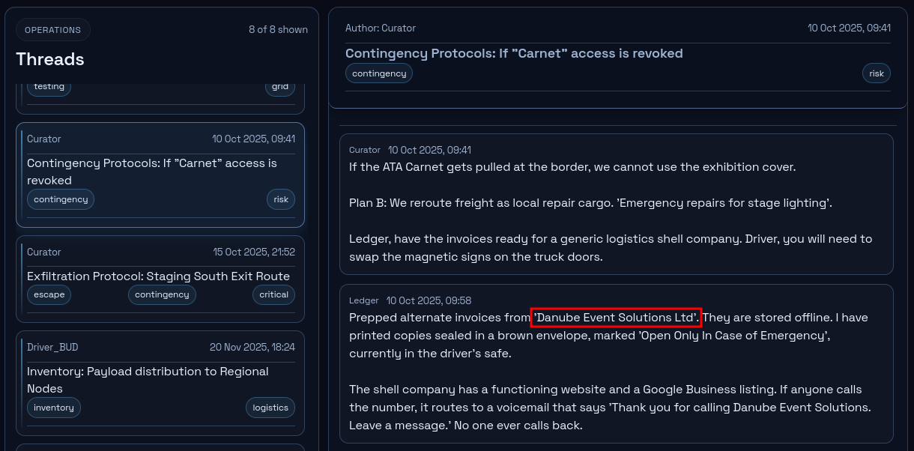

> **ANSWER:** Danube Event Solutions Ltd

## 16 What is the filename of the wipe script used to destroy evidence?

The wiper script is, of course, in the thread `Server Wipe Protocols`.

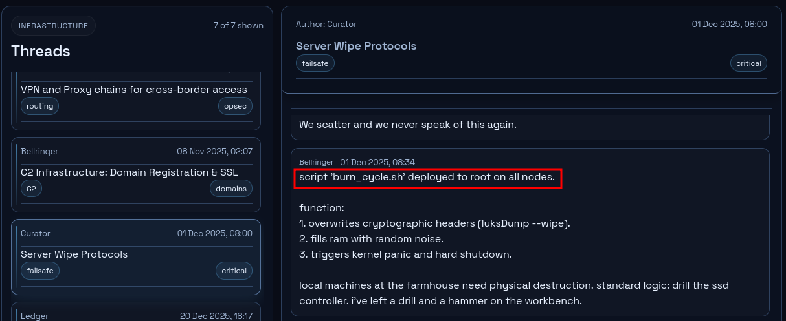

> **ANSWER:** `burn_cycle.sh`

## 17 What is the name of the escape vessel?

The thread `Exfiltration Protocol: Staging South Exit Route` is for escaping.

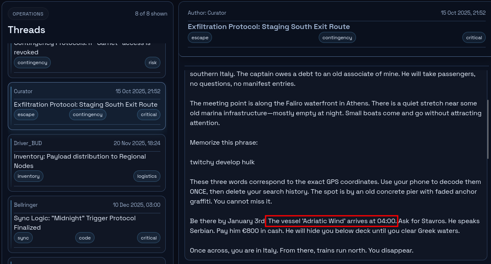

> **ANSWER:** Adriatic Wind

## 18 What is the captain's name?

In the same message as above, the captain's name is given.

> **ANSWER:** Stavros

## 19 What are the GPS coordinates of the emergency extraction point for Driver\_BUD?

Rather than the exact coordinates, we're given some code words for it in the Operations thread `Exfiltration Protocol: Staging South Exit Route`:

> Memorize this phrase:
>
> twitchy develop hulk
>
> These three words correspond to the exact GPS coordinates. Use your phone to decode them ONCE, then delete your search history. The spot is by an old concrete pier with faded anchor graffiti. You cannot miss it.

A simple Google search ([normal search](https://www.google.com/search?q=%22twitchy+develop+hulk%22) or [maps](https://www.google.com/maps/search/twitchy+develop+hulk)) doesn't work.

Looking at [the Wikipedia for GPS](https://en.wikipedia.org/wiki/Geographic_coordinate_system#Alternative_encodings), [what3words](https://en.wikipedia.org/wiki/What3words) seems to match the 3-word phrase scheme.
We can use [what3words.com](https://what3words.com/twitchy.develop.hulk) to find the coordinates.

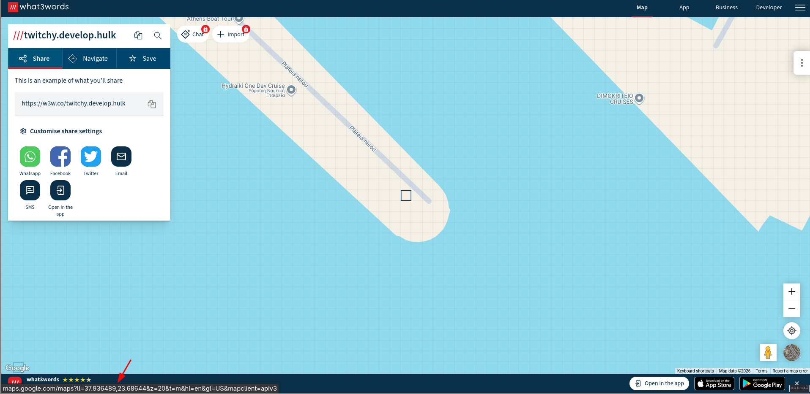

> **ANSWER:** 37.936489, 23.68644

## 20 What are the GPS coordinates of the farmhouse hideout?

Coordinates can be found in the thread `Staging Point "South": Site access and concealment` in the "Physical Logistics" category.

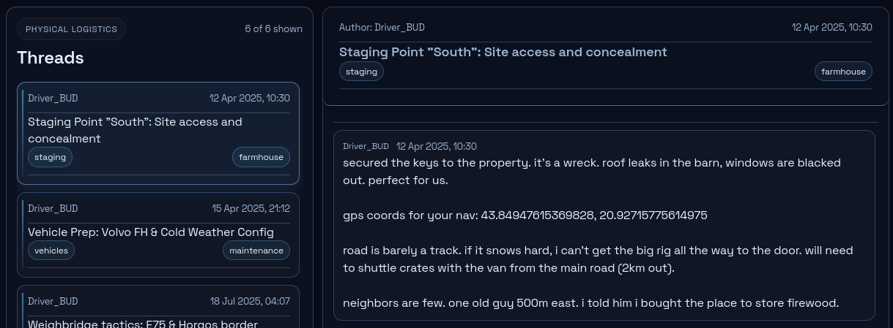

> **ANSWER:** 43.84947615369828, 20.92715775614975

