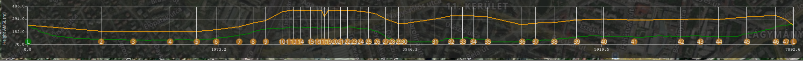
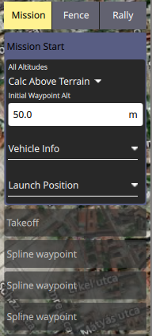
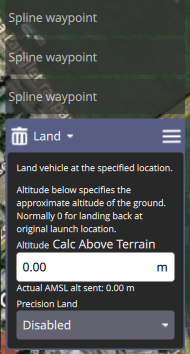
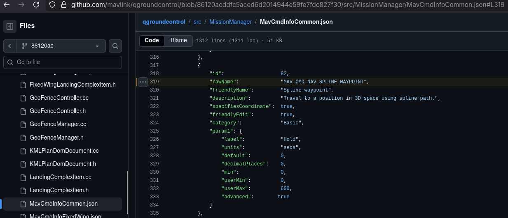
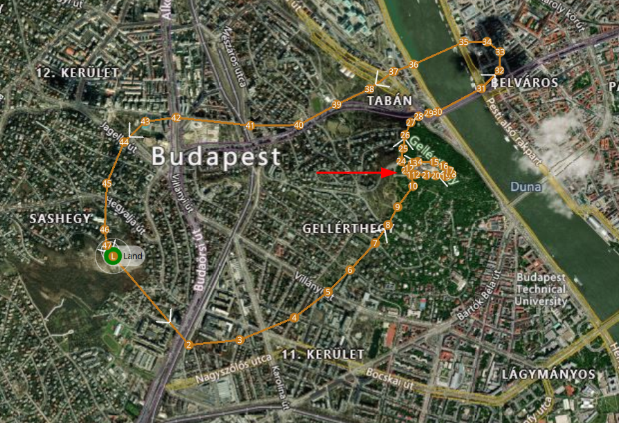
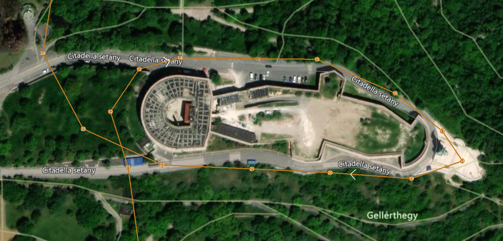
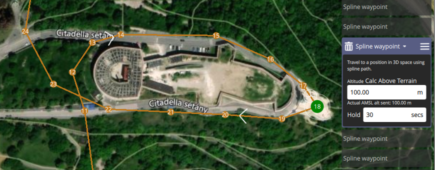
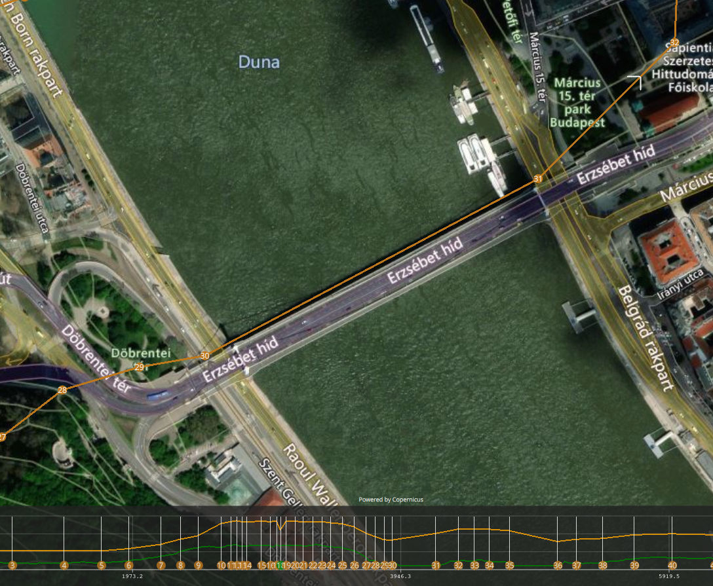

# Advent of The Relics 4 - A Drone in the Snow

Tools:
- [QGroundControl](https://qgroundcontrol.com/) is the GUI for viewing `AOTR_Winter_Blackout.plan`
- [jq](https://jqlang.org/) can also be used to process `AOTR_Winter_Blackout.plan`
- [mavlogdump.py](https://github.com/ArduPilot/pymavlink/blob/master/tools/mavlogdump.py) is used to parse `log.bin`

## 1 How many total mission items are defined in the flight plan, including Home, Takeoff, and Land commands?

```sh
$ cat AOTR_Winter_Blackout.plan | jq '.mission.items | length'
48
```

However, that's not enough, as we need to add 1 to include the starting point (this is more clearly shown if you view the plan in [QGroundControl](https://qgroundcontrol.com/)).



> **ANSWER:** 49

## 2 How many spline waypoints are in the mission?

Looking at the "Mission" column on the right, we see that all but 3 items are "Spline waypoint".




Alternatively, if we check [the source code](https://github.com/mavlink/qgroundcontrol/blob/86120acddfc5aced6d2014944e59fe7fdc827f30/src/MissionManager/MavCmdInfoCommon.json#L319), we find that the split waypoint command is 82, which can be used to filter in the `.plan` JSON.



```sh
$ cat AOTR_Winter_Blackout.plan | jq '[.mission.items[] | select(.command==82)] | length'
46
```

> **ANSWER:** 46

## 3 Which landmark/building does the drone fly around during the planned route?

Looking at the path, we notice there's a small loop.



Zooming into that loop, we find "Citadella sétány".



> **ANSWER:** Citadella

## 4 At which mission item did the drone have a planned hold/loiter?

From the aforementioned code, we see that "Hold" is the first param of the spline waypoint command, so we can filter by that.

```sh
$ cat AOTR_Winter_Blackout.plan | jq '.mission.items | to_entries | .[] | select(.value.command==82 and .value.params[0] != 0)'
{
  "key": 17,
  "value": {
    "AMSLAltAboveTerrain": 320,
    "Altitude": 100,
    "AltitudeMode": 3,
    "autoContinue": true,
    "command": 82,
    "doJumpId": 18,
    "frame": 0,
    "params": [
      30,
      0,
      0,
      0,
      47.48669332,
      19.0482644,
      320
    ],
    "type": "SimpleItem"
  }
}
```

With some manual clicking-and-searching, we can also find that item with a non-zero Hold.



> **ANSWER:** 18

## 5 How long was the planned hold time at that mission item (seconds)?

> **ANSWER:** 30

## 6 Which bridge is the drone planned to pass by while crossing the Danube in order to reach the other part of the city? (English name)



A quick search of "erzsebet hid" can get as the answer.

> **ANSWER:** Elisabeth Bridge

## 7 What is the total flight time from takeoff to crash?

```sh
$ ./mavlogdump.py --types MSG log.bin | grep -P '(Takeoff|Hit ground)' -C 1
2026-01-06 03:16:25.23: MSG {TimeUS : 41418426, Message : EKF3 IMU0 is using GPS}
2026-01-06 03:16:32.70: MSG {TimeUS : 48893768, Message : Mission: 1 Takeoff}
2026-01-06 03:16:35.22: MSG {TimeUS : 51408595, Message : EKF3 IMU0 MAG0 in-flight yaw alignment complete}
--
2026-01-06 03:26:59.84: MSG {TimeUS : 676026148, Message : Disarming motors}
2026-01-06 03:26:59.84: MSG {TimeUS : 676028647, Message : Mission: 1 Takeoff}
2026-01-06 03:27:11.62: MSG {TimeUS : 687813098, Message : SIM Hit ground at 12.93254 m/s}
2026-01-06 03:28:44.40: MSG {TimeUS : 780593471, Message : ArduCopter V4.4.4 (865cffa5)}
```

The 2nd "Takeoff" is after "Disarming motors" so we ignore that.
We then take the `TimeUS` difference between the 1st "Takeoff" message & the "Hit ground" message.

```py
from datetime import timedelta
print(timedelta(milliseconds=(687813098-48893768)/1000))
# 0:10:38.919330
```

> **ANSWER:** 00:10:38.919

## 8 What is the exact log timestamp of the crash event (TimeUS)?

```sh
$ ./mavlogdump.py --types MSG log.bin | grep 'SIM Hit ground'
2026-01-06 03:27:11.62: MSG {TimeUS : 687813098, Message : SIM Hit ground at 12.93254 m/s}
```

> **ANSWER:** 687813098

## 9 What are the coordinates where the drone crashed (lat, lon)?

```sh
$ ./mavlogdump.py --types MSG,GPS log.bin | grep 'Hit ground' -C1
2026-01-06 03:27:11.59: GPS {TimeUS : 687783943, I : 0, Status : 6, GMS : 160049600, GWk : 2400, NSats : 10, HDop : 1.21, Lat : 47.4903055, Lng : 19.0460476, Alt : 121.76, Spd : 3.207000255584717, GCrs : 294.954833984375, VZ : 12.932000160217285, Yaw : 0.0, U : 1}
2026-01-06 03:27:11.62: MSG {TimeUS : 687813098, Message : SIM Hit ground at 12.93254 m/s}
2026-01-06 03:27:11.79: GPS {TimeUS : 687983863, I : 0, Status : 6, GMS : 160049800, GWk : 2400, NSats : 10, HDop : 1.21, Lat : 47.4903071, Lng : 19.0460422, Alt : 119.97, Spd : 1.2780001163482666, GCrs : 294.9342346191406, VZ : 5.133000373840332, Yaw : 0.0, U : 1}
```

In this case, we want that `Lat`/`Lng` before "SIM Hit ground".

> **ANSWER:** 47.4903055, 19.0460476

## 10 What was the ground impact speed reported at the moment of crash (m/s)?

```sh
$ ./mavlogdump.py --types MSG log.bin | grep 'SIM Hit ground'
2026-01-06 03:27:11.62: MSG {TimeUS : 687813098, Message : SIM Hit ground at 12.93254 m/s}
```

> **ANSWER:** 12.93254

## 11 What was the maximum GPS altitude reached during the flight (meters)?

```sh
$ ./mavlogdump.py --types GPS log.bin --format json | jq '.data.Alt' | sort -n | tail -1
377.07
```

> **ANSWER:** 377.07

## 12 What was the fastest GPS ground speed recorded (m/s)?

```sh
$ ./mavlogdump.py log.bin | grep -oP 'Spd : [^,]+' | cut -d' ' -f3 | sort -n | tail -1
10.24000072479248
```

> **ANSWER:** 10.24

## 13 What are the coordinates where the drone took off from (lat, lon), and therefore a good location for the police raid to catch the gang member?

```sh
$ ./mavlogdump.py --types MSG,GPS log.bin | grep Takeoff -C1
2026-01-06 03:16:32.61: GPS {TimeUS : 48803804, I : 0, Status : 6, GMS : 159410600, GWk : 2400, NSats : 10, HDop : 1.21, Lat : 47.4819399, Lng : 19.01916, Alt : 240.1, Spd : 0.0, GCrs : 335.8515930175781, VZ : 0.0, Yaw : 0.0, U : 1}
2026-01-06 03:16:32.70: MSG {TimeUS : 48893768, Message : Mission: 1 Takeoff}
2026-01-06 03:16:32.81: GPS {TimeUS : 49003724, I : 0, Status : 6, GMS : 159410800, GWk : 2400, NSats : 10, HDop : 1.21, Lat : 47.4819399, Lng : 19.01916, Alt : 240.1, Spd : 0.0, GCrs : 335.87554931640625, VZ : 0.0, Yaw : 0.0, U : 1}
--
2026-01-06 03:26:59.84: MSG {TimeUS : 676026148, Message : Disarming motors}
2026-01-06 03:26:59.84: MSG {TimeUS : 676028647, Message : Mission: 1 Takeoff}
2026-01-06 03:27:00.01: GPS {TimeUS : 676203577, I : 0, Status : 6, GMS : 160038000, GWk : 2400, NSats : 10, HDop : 1.21, Lat : 47.490191, Lng : 19.046042, Alt : 261.48, Spd : 6.578000545501709, GCrs : 82.50920104980469, VZ : 2.1450002193450928, Yaw : 0.0, U : 1}
```

The 2nd "Takeoff" is after "Disarming motors" so we ignore that.
The remaining `GPS` logs give us the `Lat`/`Lng`.

> **ANSWER:** 47.4819399, 19.0191600
